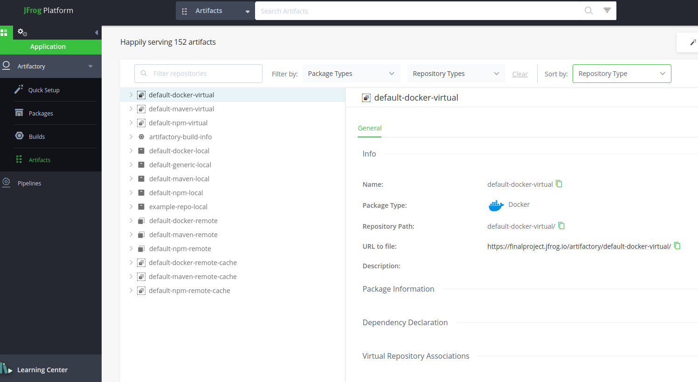

<div align="center">
  <h1>ci-final-project</h1>
</div>

# Added Project to the Repo


# Select Java with Maven Action


# Adding Unit tests to the workflow

```
  tests:
    name: Unit Tests
    needs: [ gitleaks, snyk ]
    runs-on: ubuntu-latest

    steps:
      - uses: actions/checkout@v1
      - name: Set up JDK 11
        uses: actions/setup-java@v1
        with:
          java-version: '11'

      #Set up Maven cache
      - name: Cache Maven packages
        uses: actions/cache@v1
        with:
          path: ~/.m2
          key: ${{ runner.os }}-m2-${{ hashFiles('**/pom.xml') }}
          restore-keys: ${{ runner.os }}-m2

      - name: Run Tests
        run: mvn -B test
```

<div align="center">
  
  <p>Results of the test step.</p>
</div>

We can run any job in the workflow manually
```
on:
  #Manually trigger runs
  workflow_dispatch:
  #Trigger workflow on push from main
  push:
    branches: [ main ]
  pull_request:
    types: [ opened, synchronize, reopened ]
```
and added different trigger options for the Pipeline

<div align="center">
  
  <p>Workflow Dispatch active</p>
</div>

Login to sonarcloud with GitHub


next, add repo to the sonar install


set up organization name in sonar


This key is the unique identifier of your organization. You will have to include it as a parameter when configuring your analysis. It could be the name of your company or your team.

Select Free Plan


Select Project to Analyze


Now we select the analysis method (GitHub Actions)


And we set New Code Analysis to Previous Version


Then, we create a Secret in GH


Now, we need to update our config files in the repo


DO NOT FORGET TO DISABLE THIS


Now we can do our magic in the IDE


Everything ok, but we have no coverage...


Adding JavaCodeCoverage dependencies and plugin to pom.xml


Here we can already see Tests and Sonar jobs running parallel, and build Job depending on boths previous jobs to succeed


And we have Code Coverage!


Now we set up Build Stage to push the JAR file to the workflow
We will use this JAR file in the deploy job
  ```
build:
    #Make Sonar run Build job parallel to Tests job and build only when these steps do not fail
    needs: [ tests, sonar ]
    runs-on: ubuntu-latest
    steps:
    - uses: actions/checkout@v1
    - name: Set up JDK 11
      uses: actions/setup-java@v1
      with:
        java-version: '11'
#   Adding Cache Action to build stage
    - name: Cache Maven packages
      uses: actions/cache@v1
      with:
        path: ~/.m2
        key: ${{ runner.os }}-m2-${{ hashFiles('**/pom.xml') }}
        restore-keys: ${{ runner.os }}-m2
    - name: Build with Maven
      run: mvn -B package -DskipTests --file pom.xml
    - name: Upload JAR
    #Upload artifacts workflow allowing to share data between jobs and store data once a workflow is complete.
      uses: actions/upload-artifact@v2
      with:
        name: artifact
        path: ${{ github.workspace }}
```


Adding Sonar Quality Gate to Sonar job


Make sure to set up timeout-minutes property in your step, to avoid wasting action minutes per month (see above example).
tutorial used:
https://github.com/marketplace/actions/sonarqube-quality-gate-check

Now we need to set up Quality Gate scope


Create a new QG from Organization's Settings:
On new and overall Code


for now we set these 2 to test that QG works. Then we can set up further conditions
REMEMBER TO SET THE NEW QG AS DEFAULT


Sonar job should Fail due to QG settings:
Adding SCM config to POM


---------------------------------FALTA QUE FUNCIONE QUALITY GATE --------------------------------

JFrog Artifactory

