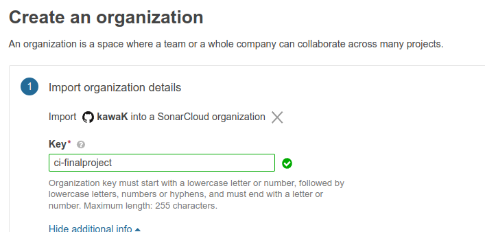

<div align="center">
  <h1>Martín Pavesio Continuous Integration Final Project</h1>
</div>
# Table of Contents
[2.1 Source code](#source-code)
[2.1 Unit Tests](#tests)

## <a name="source-code"></a>2.1 Source code

### Added Project to the Repo


### Select Java with Maven Action


## <a name="tests"></a>2.1 Unit Tests
### Adding Unit Tests Job to the workflow

```yml
  tests:
    name: Unit Tests
    needs: [ gitleaks, snyk ]
    runs-on: ubuntu-latest

    steps:
      - uses: actions/checkout@v1
      - name: Set up JDK 11
        uses: actions/setup-java@v1
        with:
          java-version: '11'

      #Set up Maven cache
      - name: Cache Maven packages
        uses: actions/cache@v1
        with:
          path: ~/.m2
          key: ${{ runner.os }}-m2-${{ hashFiles('**/pom.xml') }}
          restore-keys: ${{ runner.os }}-m2

      - name: Run Tests
        run: mvn -B test
```

<div align="center">
  <p>Results of the test step.</p>
  
</div>

We can run any job in the workflow manually and add different trigger options for the Pipeline

```yml
on:
  #Manually trigger runs
  workflow_dispatch:
  #Trigger workflow on push from main
  push:
    branches: [ main ]
  pull_request:
    types: [ opened, synchronize, reopened ]
```

<div align="center">
  
  <p>Workflow Dispatch active</p>
</div>

## 2.2 Quality Gate with SonarQube
### Login to sonarcloud with GitHub
<div align="left">
  
</div>

next, add repo to the sonar install
<div align="left">
  
</div>

set up organization name in sonar
<div align="left">
  
    <p>This key is the unique identifier of your organization. You will have to include it as a parameter when configuring your analysis. It could be the name of your company or your team.
</p>
</div>

Select Free Plan
<div align="left">
  
</div>

Select Project to Analyze
<div align="left">
  
</div>

Now we select the analysis method (GitHub Actions)
<div align="left">
  
</div>

And we set New Code Analysis to Previous Version
<div align="left">
  
</div>

Then, we create a Secret in GH using this values
<div align="left">
  
</div>

<div align="left">
  
</div>

<div align="left">
  
</div>

Now, we select the Build Configuration for our project
<div align="left">
  
</div>

DO NOT FORGET TO DISABLE AUTOMATIC ANALYSIS
<div align="left">
  
</div>

Now we have to setup our pom.yml with the given parameters in the previous example
<div align="left">
  
</div>

Everything ok, but code coverage still missing...
<div align="left">
  
</div>

Adding JavaCodeCoverage dependencies and plugin to pom.xml


Now we set up Build Stage.
```yml
build:
    #Make Sonar run Build job parallel to Tests job and build only when these steps do not fail
    needs: [ tests, sonar ]
    runs-on: ubuntu-latest
    steps:
    - uses: actions/checkout@v1
    - name: Set up JDK 11
      uses: actions/setup-java@v1
      with:
        java-version: '11'

#   Adding Cache Action to build stage
    - name: Cache Maven packages
      uses: actions/cache@v1
      with:
        path: ~/.m2
        key: ${{ runner.os }}-m2-${{ hashFiles('**/pom.xml') }}
        restore-keys: ${{ runner.os }}-m2

    - name: Build with Maven
      run: mvn -B package -DskipTests --file pom.xml

    #Upload artifacts workflow allowing to share data between jobs and store data once a workflow is complete.
    - name: Upload JAR
      uses: actions/upload-artifact@v2
      with:
        name: artifact
        path: ${{ github.workspace }}
```

Here we can already see Tests and Sonar jobs running parallel, and build Job depending on boths previous jobs to succeed


And we have Code Coverage!


Adding Sonar Quality Gate to Sonar job
```yml
  sonar:
    continue-on-error: true
    name: SonarCloud Analysis (allow failure)
    needs: [ gitleaks, snyk ]
    runs-on: ubuntu-latest
    steps:
      - uses: actions/checkout@v1
      - name: Set up JDK 11
        uses: actions/setup-java@v1
        with:
          java-version: '11'
#          fetch-depth: 0
      - name: Cache SonarCloud packages
        uses: actions/cache@v1
        with:
          path: ~/.sonar/cache
          key: ${{ runner.os }}-sonar
          restore-keys: ${{ runner.os }}-sonar
      - name: Cache Maven packages
        uses: actions/cache@v1
        with:
          path: ~/.m2
          key: ${{ runner.os }}-m2-${{ hashFiles('**/pom.xml') }}
          restore-keys: ${{ runner.os }}-m2
      #Analyze project with SonarCloud
      - name: Clone Repo
        uses: actions/checkout@v2
      - name: Analyze with SonarCloud
        run: mvn -B verify sonar:sonar -Dsonar.qualitygate.wait=true
        env:
          GITHUB_TOKEN: ${{ secrets.GITHUB_TOKEN }}
          SONAR_TOKEN: ${{ secrets.SONAR_TOKEN }}
```


Make sure to set up timeout-minutes property in your step, to avoid wasting action minutes per month (see above example).
tutorial used:
https://github.com/marketplace/actions/sonarqube-quality-gate-check

Now we need to set up Quality Gate scope


Create a new QG from Organization's Settings:
On new and overall Code


for now we set these 2 to test that QG works. Then we can set up further conditions
REMEMBER TO SET THE NEW QG AS DEFAULT


Sonar job should Fail due to QG settings


In this case we set up `continue-on-error: true` param to be able to build and continue with the tasks.

## 2.3 Storing Artifacts with JFrog Artifactory

Final Build Job

```yml
  build:
    name: Build
    #Make Sonar run Build job parallel to Tests job and build only when these steps do not fail
    needs: [ sonar, tests ]
    runs-on: ubuntu-latest
    steps:
    - uses: actions/checkout@v2
    - name: Set up JDK 11
      uses: actions/setup-java@v1
      with:
        java-version: '11'

#   Adding Cache Action to build stage
    - name: Cache Maven packages
      uses: actions/cache@v1
      with:
        path: ~/.m2
        key: ${{ runner.os }}-m2-${{ hashFiles('**/pom.xml') }}
        restore-keys: ${{ runner.os }}-m2

    - name: Set Up Custom Artifactory Instance
      uses: actions/setup-java@v1
      with:
        java-version: '11'
        server-id: artifactory
        server-username: ARTIFACTORY_USERNAME_REF
        server-password: ARTIFACTORY_TOKEN_REF

    - name: Build with Maven and Upload to Artifactory.
      run: mvn -B package -DskipTests --file pom.xml
      env:
        ARTIFACTORY_TOKEN_REF: ${{ secrets.ARTIFACTORY_TOKEN }}
        ARTIFACTORY_USERNAME_REF: ${{ secrets.ARTIFACTORY_USERNAME }}

#    Upload artifacts workflow allowing to share data between jobs and store data once a workflow is complete.
    - name: Upload JAR
      uses: actions/upload-artifact@v2
      with:
        name: build-artifact
        path: ${{ github.workspace }}
```
POM.xml configuration
https://github.com/kawak1320/ci-final-project/blob/main/pom.xml

Adding SCM config to POM.xml


JFrog Artifactory Repos

Here i've been having issues to upload correctly the artifacts to artifactory. Still couldn't find the proper setting.
I will do further research on Maven and JFrog settings.

## 2.4 Integrating DevSecOps
### Gitleaks
```yml
  gitleaks:
    name: gitleaks
    runs-on: ubuntu-latest
    steps:
      - uses: actions/checkout@v2
        with:
          fetch-depth: '0'
      - name: gitleaks-action
        uses: zricethezav/gitleaks-action@master
```


### Snyk
```yml
  snyk:
    runs-on: ubuntu-latest
    steps:
      - uses: actions/checkout@master
      - name: Run Snyk to check for vulnerabilities
        uses: snyk/actions/maven@master
        continue-on-error: true # To make sure that SARIF upload gets called
        env:
          SNYK_TOKEN: ${{ secrets.SNYK_TOKEN }}
        with:
          args: --sarif-file-output=snyk.sarif
```


## 2.5 Additional tasks
- Leverage the GitLab/GitHub cache feature in the pipeline
<p>This step was applied in every Job.</p>

```yml
#   Adding Cache Action to build stage
    - name: Cache Maven packages
      uses: actions/cache@v1
      with:
        path: ~/.m2
        key: ${{ runner.os }}-m2-${{ hashFiles('**/pom.xml') }}
        restore-keys: ${{ runner.os }}-m2
```
- Make some stages run in parallel – for example have unit tests run in parallel with sonar, not sequentially


- Find and fix a vulnerability found by security tools – if you do this, should be shown what was fixed as a merge request.

- Create a docker image of your application and store in the GitLab Docker Registry or Artifactory or AWS ECR as part of the pipeline